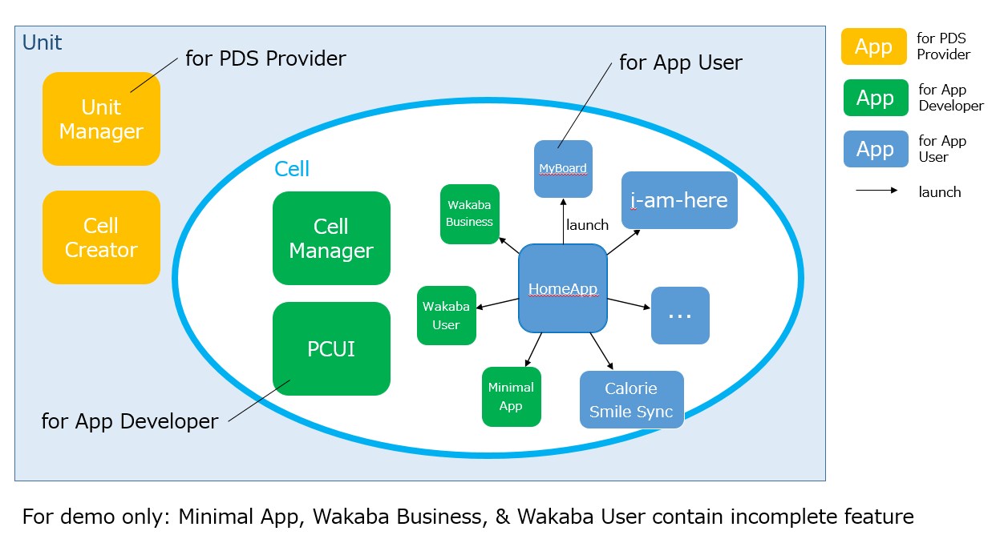

# Hands-on Demo 2017  
Instructions of hands-on demo for Fujitsu Forum Europe.  

# App Overview  
The following diagram shows all types of app that can be used on different Personium object level (unit or cell).  
  

We will be using the following apps during the hands-on demo.  

1. [Cell Creator](https://github.com/personium/app-uc-cell-creator-wizard)  
1. [HomeApp](https://github.com/personium/app-cc-home)  
1. [Cell Manager](https://github.com/personium/app-uc-unit-manager)  

# Demo  
1. Audience can follow the instructions from the [Basic & Advance Scenarios](README_audience.md)  
1. Presenter must interact with the audience with [friendly actions](README_presenter.md)  
