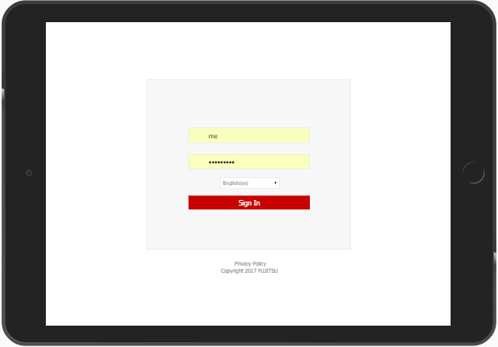
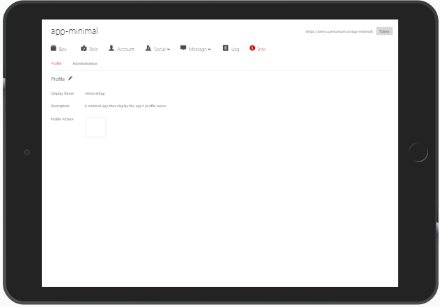
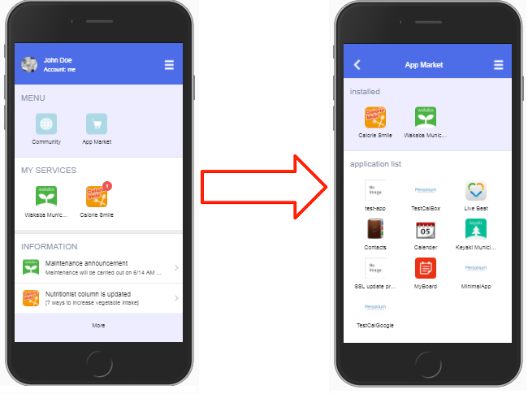
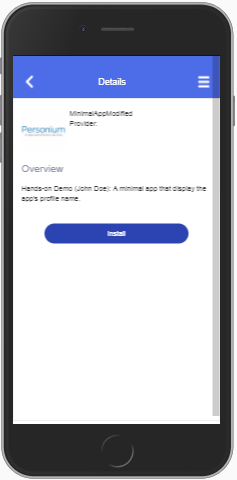
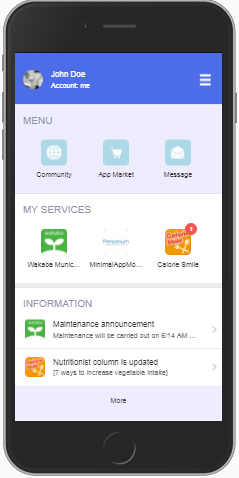

# Hands-on Demo 2017  
Instructions of hands-on demo for participant.  

# Advance Scenario  
You get to modify the [MinimalApp](https://github.com/personium/template-app-cell) and launch it from HomeApp.  

1. Access the MinimalApp cell from the [Cell Manager](  
https://demo.personium.io/app-minimal/io_personium_demo_cell-manager/src/login.html)  
  

1. Click "Info" to display the profile.  

1. Click the Pencil icon and modify the profile with the following information. 
    1. Before  
        - Display Name: MinimalApp  
        - Description: A minimal app that display the app's profile name.

    1. After (replace John Doe with your name)  
        - Display Name: MinimalAppModified  
        - Description: Hands-on Demo (John Doe): A minimal app that display the app's profile name.

1. Access the HomeApp of the cell created in Basic Scenario.  
Click App Market  
  
1. Click MinimalAppModified to display the description.  
  
1. Install the app and confirm that it is displayed in the Home screen.  
  
1. Launch it  
1. You can also try to modify the app.html in the main box's src folder.  
(Go back to procedure No.1)

# Extra Scenario  
For challengers, when you got back to your office, you can follow the deployment instructions in [GitHub](https://github.com/personium/template-app-cell) to create a [minimal app](https://github.com/personium/template-app-cell) and launch it from HomeApp.  
