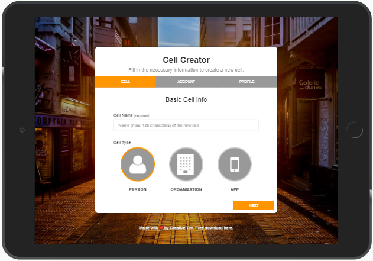
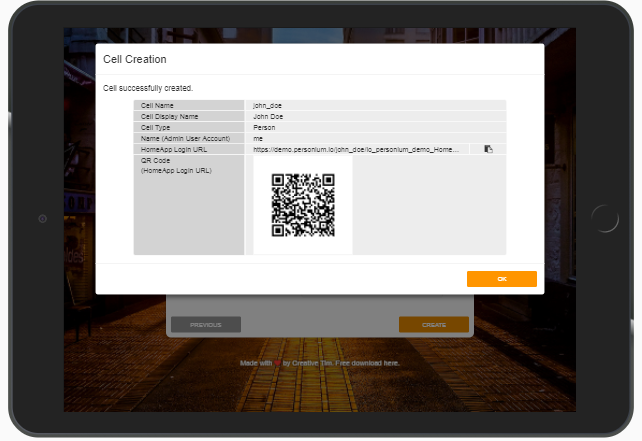
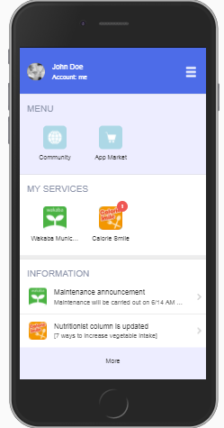
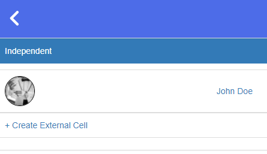
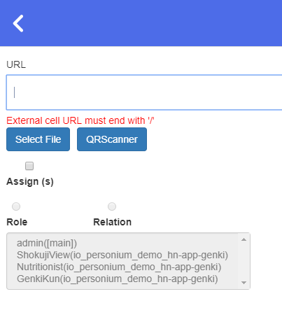
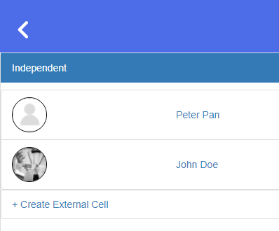
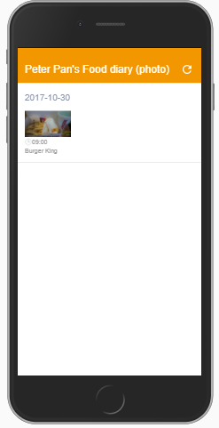

# Hands-on Demo 2017  
Instructions of hands-on demo for audience.  

# Basic Scenario #1  
You get to create your own app user cell and ask Peter Pan's permission to view his photo diaries.  

## Prerequisites  
Create a Person cell and login to the HomeApp.  

1. Click the following image to access the Cell Creator Wizard (demo version) and then ask the presenter to switch to the "REAL" version for you.   
  
1. Enter a name for the cell. Click NEXT.  
1. Fill in the admin account fields. Click NEXT.  
1. Click NEXT (we will skip the profile editing).  
1. Click CREATE. And wait for the dialog with all the information.  
(this is a sample image)  
  
1. Now, access the HomeApp of the newly created cell either from Chrome (using the copy and paste icon) or by scanning the QR Code with a mobile device.  
1. Login.  

## Procedures  
1. Login.  
1. From Community, add Peter Pan as an external cell.  
	1. Click Community.  
	  
	1. Click Create External Cell.  
	  
	1. Enter Peter Pan's cell URL.  
	  
    	1. If you are accessing the HomeApp form an Android phone, click QRScanner to scan the QR Code below directly.  
    	  
    	1. Otherwise, you have to enter the cell URL manually.  

    			https://demo.personium.io/demo-english-user-003/

    1. Click Add.  
    1. Confirm that Peter Pan is added.  
      
    1. Go back to the main screen.  

1. From App Market, install Calorie Smile.  
The main screen will be displayed automatically.  
1. Launch Calorie Smile and display the photo diaries.  
1. Send a view permission to Peter Pan.  
	1. Click the hamburger menu.  
	1. Click Send View Permission.  
	1. Select Peter Pan and click Send.  
	1. Close the dialog.  
	1. Close the side menu.  
1. Wait for Peter Pan's approval.  
1. View Peter Pan's food diaries.  
  
