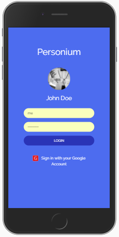
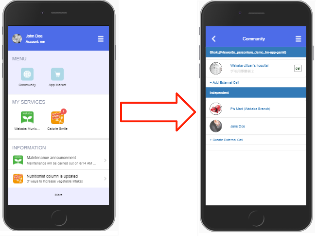
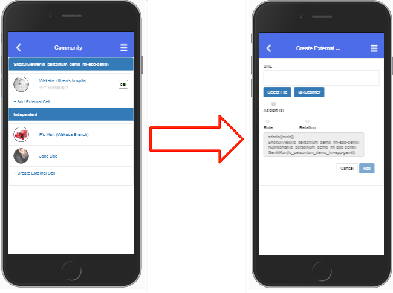
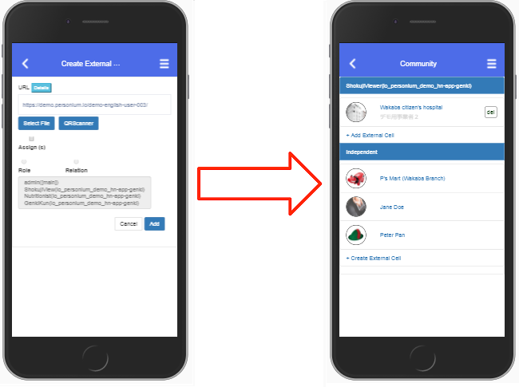
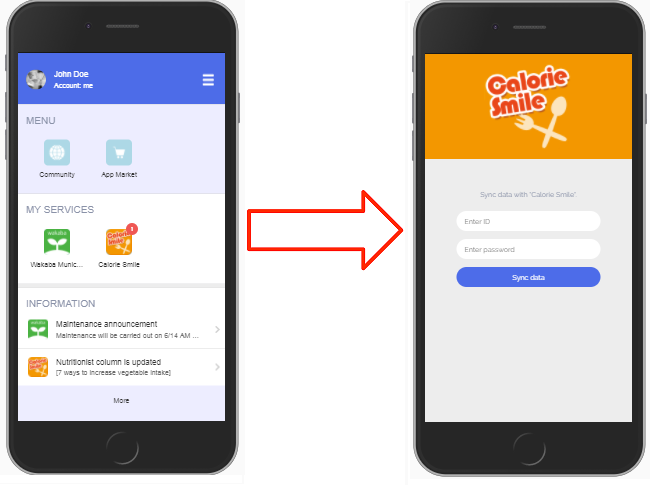
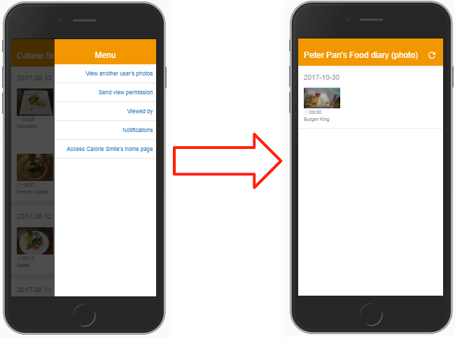

# Hands-on Demo 2017  
Instructions of hands-on demo for participant.  

# Basic Scenario  
You get to create your own Personium cell (for personal use) and ask Peter Pan's permission to view his photo diaries.  

# 1. How to Create a Cell   
Create a Personium cell (cell type: PERSON) and login to the HomeApp.  

1. Click the following image to access the Cell Creator Wizard (demo version) and then ask the presenter to switch to the "REAL" version for you.   
  
1. Enter a name for the cell. Click NEXT.  
1. Fill in the admin account fields. Click NEXT.  
1. Click NEXT (we will skip the profile editing).  
1. Click CREATE. And wait for the dialog with all the information.  
(the image below is just a sample image)  
  

# 2. How to Login to HomeApp  
1. Now, access the HomeApp of the newly created cell either from Chrome (using the copy and paste icon) or by scanning the QR Code with a mobile device.  
1. Login.  
  
1. From App Market, install Calorie Smile.  
The main screen will be displayed automatically. 
1. From Community, add Peter Pan as an external cell.  
    1. Click Community.  
      
    1. Click Create External Cell.  
      
    1. Enter Peter Pan's cell URL.  
        1. If you are accessing the HomeApp form an Android phone, click QRScanner to scan the QR Code directly.  
        Ask the presenter to show you the QR Code.  
        1. Otherwise, you have to enter the following cell URL manually.  

                https://demo.personium.io/demo-english-user-003/

    1. Click Add and confirm that Peter Pan is added.  
      
    1. Go back to the main screen.  

1. Launch Calorie Smile and login for the first time.  
Ask the presenter for login info (sample account).   
  
1. Display the menu.  
  
1. Click Send view permission, select Peter Pan and click send.  
  
1. Close the dialog.  
1. Close the side menu.  
1. Ask the presenter to approve your request.  
Wait for Peter Pan's approval.  
1. View Peter Pan's food diaries.  
  
