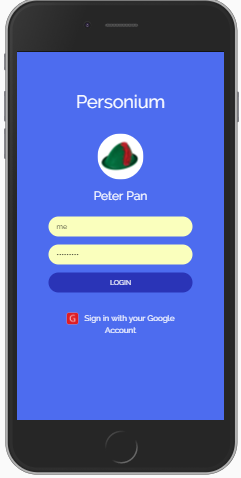
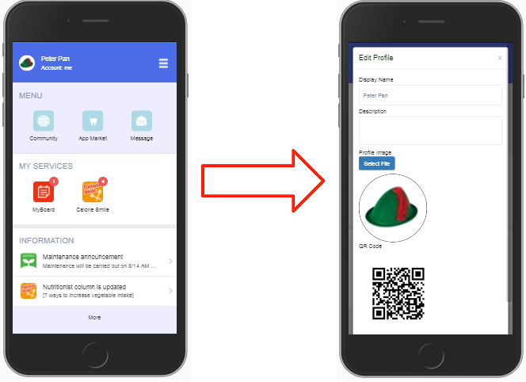
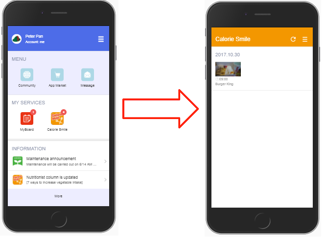
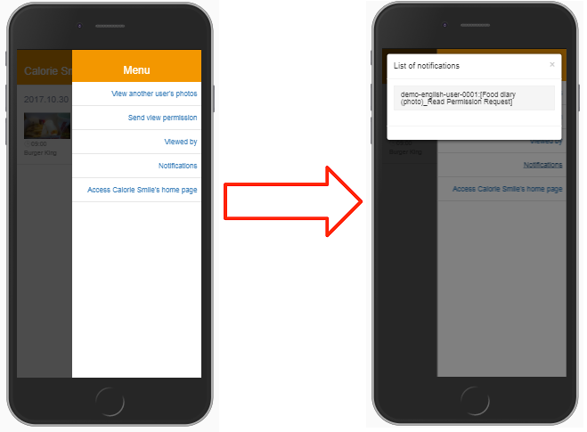
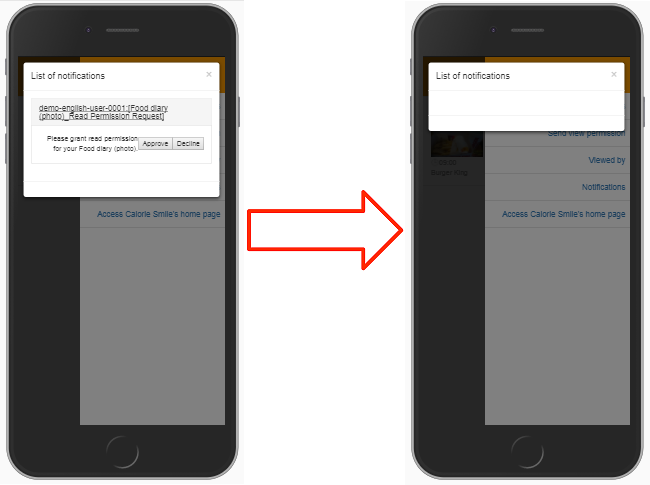

# Hands-on Demo 2017  
Instructions of hands-on demo for presenter.  

# Peter Pan (Let's make a lot of friends)  
Perform the following procedures to approve a Read Permission Request.  

1. Access HomeApp of Peter Pan.  
Scan the following QR Code or click the image.  
  
1. Login  
  

# How to display your QR Code (Cell URL)  
1. Tap the "Hat" to display your QR Code (Cell URL ) which the participant will scan it.  
  

# How to approve read permission (Calorie Smile)  
1. Tap the Calorie Smile icon to launch Calorie Smile.  
  
1. Tap the hamburger menu, tap Notifications to display the list of notications.  
  
1. Tap the message and then tap "Approve".  
  
1. Finish. Go back to the home screen.  
