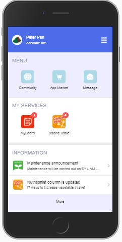
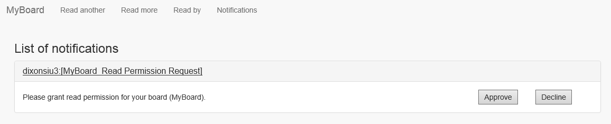

# Hands-on Demo 2017  
Instructions of hands-on demo for presenter.  

# Peter Pan (Let's make a lot of friends)  
Perform the following procedures to approve a Read Permission Request.  

1. Access HomeApp of Peter Pan.  
Scan the following QR Code or click the image.  
  
1. Login  
1. Launch Calorie Smile.  
  
1. Click Notifications to display the list of notications.  
1. Click xxx:[MyBoard_Read Permission Request] to read the message and then click "Approve"  
  
